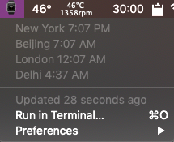

# My BitBar plugins

- Timezones
  - Shows times of various world locations upon clicking on the watch emoji in the Menu Bar

To change update frequency, rename the `n` in a file here in the format `name.n.sh` to a time of the form `<number><s/m/h>` (seconds, minutes, hours).

[BitBar](https://github.com/matryer/bitbar)
